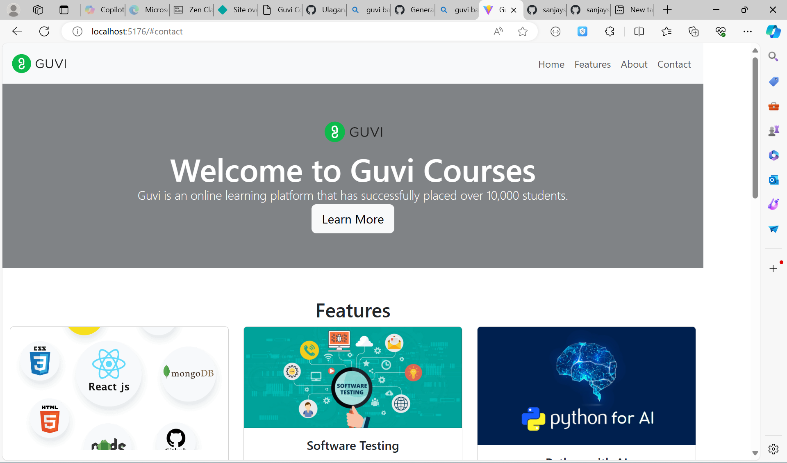

# Guvi Courses Landing Page

This project is a landing page for Guvi Courses, built using React, Vite, and Bootstrap. It showcases the main features of the platform and provides information about the courses and the team.

## Live Demo

You can view the live demo of the project [here](https://guvilandingpage.netlify.app/).

### Note 

I have able to view logo image and banner images on localhost  platform is blocked images

## Project Overview

The landing page includes the following sections:
- **Navbar**: A responsive navigation bar with links to different sections of the page.
- **Header**: A welcoming banner with the Guvi logo and an introductory message.
- **Features**: A section highlighting the key courses offered by Guvi, each with an image and description.
- **About**: Information about the Guvi platform.
- **Team**: Details about the team members.
- **Contact**: Contact information for reaching out to Guvi.
- **Footer**: A footer with copyright information.

## Technologies Used

- **React**: A JavaScript library for building user interfaces.
- **Vite**: A build tool that provides a fast development environment.
- **Bootstrap**: A CSS framework for building responsive and modern websites.
- **Netlify**: A platform for deploying and hosting web applications.

## Getting Started

Follow these steps to set up the project locally:

### Prerequisites

- Node.js and npm installed on your machine.

### Installation

1. **Clone the repository:**

   ```bash
   git clone https://github.com/Ulaganathan0709/landing-page
   cd guvi-courses-landing-page'

